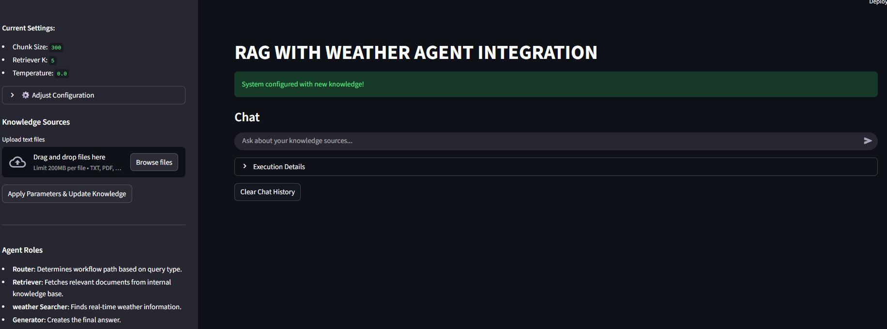
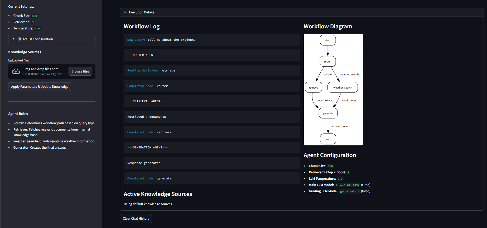
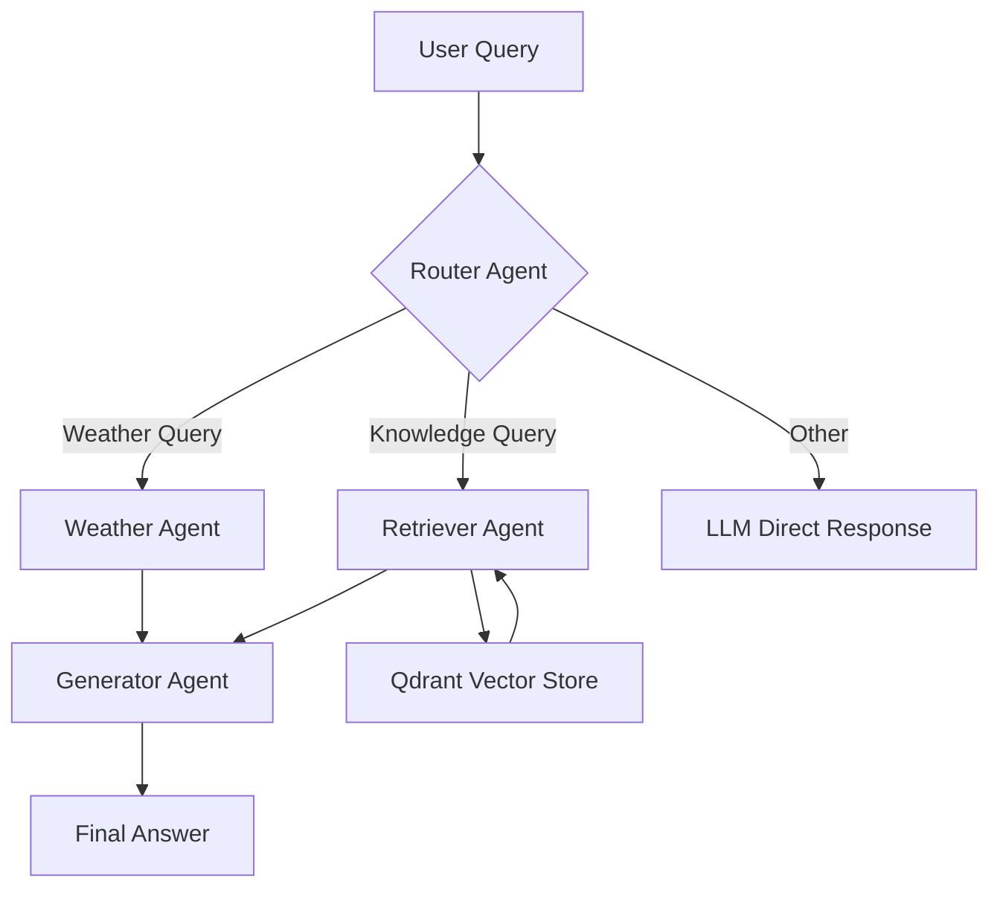

# RAG System with Weather API
A powerful, multi-agent Retrieval-Augmented Generation (RAG) application built with **Streamlit**, **LangChain**, **Groq LLMs**, and **Qdrant**. This project demonstrates a modular agent-based workflow capable of answering both knowledge-based queries and real-time weather questions using external APIs.

---

## 🧠 **Architecture & Workflow**
This system uses a multi-agent design:

### **🔀 Router Agent**
Decides the correct path based on the user query:
- Weather-related → Weather Agent
- Knowledge-related → RAG Agent
- Otherwise → Default LLM response

### **📚 Retriever Agent**
Fetches relevant documents from the internal knowledge base stored in **Qdrant**.

### **🌦️ Weather Agent**
Fetches real-time weather information using the **OpenWeather API**.

### **✍️ Generator Agent**
Generates the final user-facing answer by combining retrieved context + reasoning.

---

## 📦 **Installation & Setup**

### **1. Clone the Repository**
```bash
git clone https://github.com/your-username/your-repo-name.git
cd your-repo-name
```

### **2. Create a Virtual Environment**
```bash
python -m venv venv
source venv/bin/activate  # On Windows: venv\Scripts\activate
```

### **3. Install Dependencies**
```bash
pip install -r requirements.txt
```
> **Note:** Python 3.9+ recommended.

### **4. Set Up API Keys**
Create a `.streamlit/secrets.toml` file:

```toml
LANGCHAIN_API_KEY = "your_langchain_api_key"
GOOGLE_API_KEY = "your_google_api_key"
GROQ_API_KEY = "your_groq_api_key"
OPEN_WEATHER_API_KEY = "your_openweather_api_key"
Qdrant_API_KEY = "your_qdrant_api_key"
Qdrant_END_POINT = "your_qdrant_endpoint"
```

### **Sources for API Keys**
- LangChain
- Google Generative AI
- Groq
- Qdrant
- OpenWeather

### **5. Run the Application**
```bash
streamlit run app.py
```

---

## 💡 **Usage Guide**

### **1. Configure Knowledge Sources**
- Upload TXT, PDF, or DOCX files from the sidebar.
- Modify chunk size, retriever K-value, and LLM temperature.
- Click **"Apply Parameters & Update Knowledge"** to rebuild the Qdrant vector store.

### **2. Chat**
- Enter your question.
- The system routes and processes your query via the agent workflow.
- View the generated answer.

### **3. Execution Details**
- See workflow diagrams.
- Inspect logs.
- View uploaded documents.

### **4. Reset**
Click **"Clear Chat History"** to reset all messages and logs.

---

## 📝 **Requirements**
- Python 3.9+
- Streamlit
- Groq LLMs
- LangChain
- Google Generative AI API
- Qdrant
- OpenWeather API
- Additional packages listed in `requirements.txt`

---

## 📸 Project Screenshots

> Add your screenshots inside the `assets/` folder and update paths accordingly.

Example:
```md


```

---

## 🔀 Agent Workflow Diagram (Mermaid)



---

## 🙏 **Acknowledgements****
- LangChain
- Streamlit
- Groq
- Google Generative AI
- OpenWeather
- Qdrant

---

## ⭐ **Support**
If you find this project useful, consider starring the repository!
